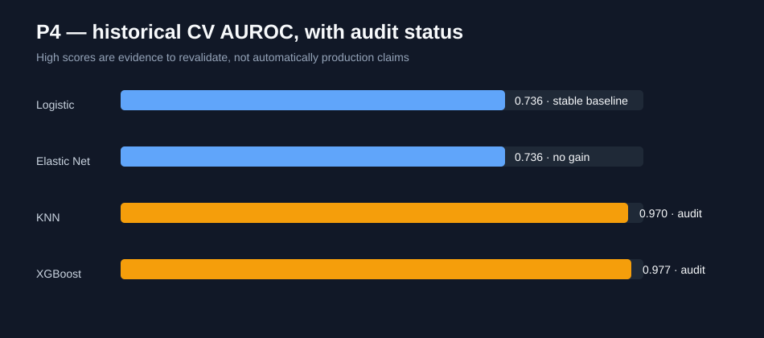

# Credit Risk Model Comparison

A reproducible comparison of interpretable and ensemble classifiers for imbalanced credit-risk data.

## Portfolio story

The project demonstrates how model selection changes when false negatives are more costly than false positives. It compares logistic regression and tree ensembles through a shared preprocessing pipeline, stratified validation and business-aware metrics.

## Highlights

- schema validation and leakage-resistant train/test separation;
- median imputation, scaling and one-hot encoding in a single pipeline;
- class weighting instead of opaque resampling by default;
- ROC-AUC, average precision, recall and confusion-matrix reporting;
- no customer data, pickle artifact or course document in the repository;
- synthetic fixtures for deterministic tests.

## Quick start

```bash
python -m venv .venv
pip install -e .[dev]
pytest
jupyter lab notebooks/model_comparison.ipynb
```

## Case-study gallery

The two substantial historical notebooks and both active branches are distilled into four reviewable questions:

| Study | What it demonstrates |
|---|---|
| [01 — Model families](notebooks/01_model_families.ipynb) | logistic regression, nearest neighbours, decision trees and ensembles under one protocol |
| [02 — Imbalance strategies](notebooks/02_imbalance_strategies.ipynb) | class weights versus SMOTE, evaluated only inside training folds |
| [03 — Decision threshold](notebooks/03_decision_threshold.ipynb) | business-cost-aware threshold selection instead of defaulting to 0.5 |
| [04 — Explainability and fairness](notebooks/04_explainability_fairness.ipynb) | global/local explanations, subgroup checks and governance boundaries |
| [End-to-end comparison](notebooks/model_comparison.ipynb) | reproducible synthetic benchmark |

## Historical evidence, re-audited with current standards

The 33-cell V2 notebook contains 53 stored outputs and 22 rendered figures. It evaluates logistic regression, Elastic Net, decision trees, Random Forest, KNN and XGBoost after iterative imputation, scaling and SMOTE.

Verified historical outputs include:

| Experiment | Recorded result | Modern interpretation |
|---|---:|---|
| Logistic regression ROC analysis | AUROC 0.729 | sensitivity 0.95 required a threshold of 0.25 and specificity fell to 0.22 |
| Logistic grid search | CV AUROC 0.736 ± 0.002 | stable linear baseline |
| Elastic Net grid search | CV AUROC 0.736 ± 0.002 | regularisation added complexity without measurable gain |
| KNN grid search | best CV AUROC 0.970 | must be rerun with fold-contained resampling before promotion |
| XGBoost grid search | best CV AUROC 0.977 | large fold variance and preprocessing protocol require audit |



The [experiment audit](docs/experiment_audit.md) identifies stale prediction variables, incorrect ROC-model reuse and validation risks, then maps them to the corrected public pipeline. This demonstrates not only modelling breadth but the ability to review legacy ML rigorously.

IDE settings, pickles, course material and unlicensed customer data remain excluded. The separate `projet_4_V2` repository contained no additional implementation to preserve.

## Data

The original experiment used Home Credit-style application features. No source dataset is redistributed. Use an authorized copy of a clearly licensed dataset and record its version in `data/README.md`.

## Responsible modelling

This is an educational comparison, not a lending decision system. A production credit model requires legal review, fairness testing, explainability, monitoring and human governance.

## License

Code is released under the [MIT License](LICENSE); datasets retain their own terms.

